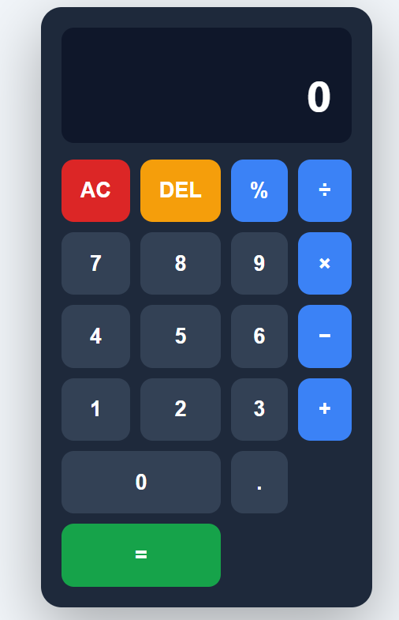

# Calculator-Project

A simple and responsive calculator built using **HTML, CSS, and JavaScript**.  
This project performs basic arithmetic operations and demonstrates fundamental front-end development concepts.

## 🌐 Live Demo

You can view the live project here:  
(https://vaibh31.github.io/Calculator-Project/)

## 🚀 Features

- Basic arithmetic operations
  - Addition
  - Subtraction
  - Multiplication
  - Division
- Clean and simple user interface
- Responsive layout
- Built using pure JavaScript (no libraries)

## 🛠️ Technologies Used

- HTML5
- CSS3
- JavaScript 

## 📁 Project Structure

```
calculator/
│
├── index.html
├── script.js
└── README.md
```

## 📸 Preview


