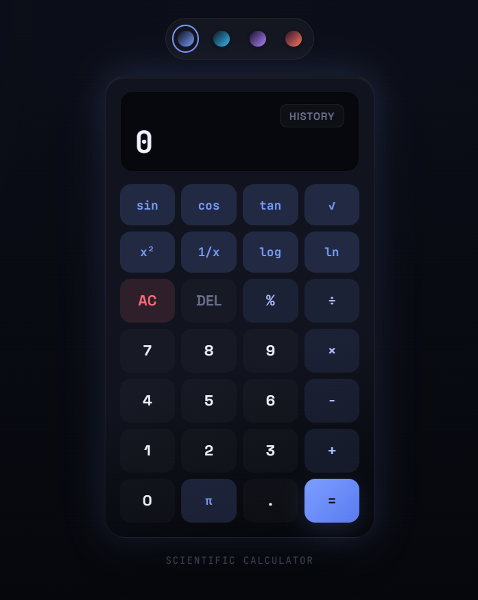

# 🧮 Scientific Calculator

A modern and responsive Scientific Calculator built using **HTML, CSS, and JavaScript**. This project performs both basic arithmetic and scientific calculations while showcasing front-end development skills, interactive UI design, multiple themes, keyboard support, and calculation history.

## 🌐 Live Demo

🔗 https://vaibh31.github.io/Calculator-Project/

## 🚀 Features

### Basic Arithmetic Operations
- Addition (+)
- Subtraction (-)
- Multiplication (×)
- Division (÷)
- Modulus (%)

### Scientific Functions
- Sine (sin)
- Cosine (cos)
- Tangent (tan)
- Square Root (√)
- Square (x²)
- Reciprocal (1/x)
- Logarithm (log)
- Natural Logarithm (ln)
- Pi (π)

### Additional Features
- 🎨 Multiple Theme Options
- 📜 Calculation History
- ⌨️ Keyboard Support
- ✨ Smooth Animations & Ripple Effects
- 📱 Fully Responsive Design
- ⚡ Fast and Lightweight
- 🚫 Error Handling for Invalid Operations

## 🛠️ Technologies Used

- HTML5
- CSS3
- JavaScript (Vanilla JS)

## 📂 Project Structure

```text
Calculator-Project/
│
├── index.html
├── script.js
└── README.md
```

## 🎯 Learning Objectives

This project demonstrates:
- DOM Manipulation
- Event Handling
- JavaScript Functions
- Responsive Web Design
- UI/UX Design Principles
- Theme Management
- State Management in JavaScript

## 🤝 Contributing

Contributions are welcome. Feel free to fork this repository and submit a pull request with improvements.
---

⭐ If you found this project helpful, don't forget to star the repository!

## 📸 Preview


